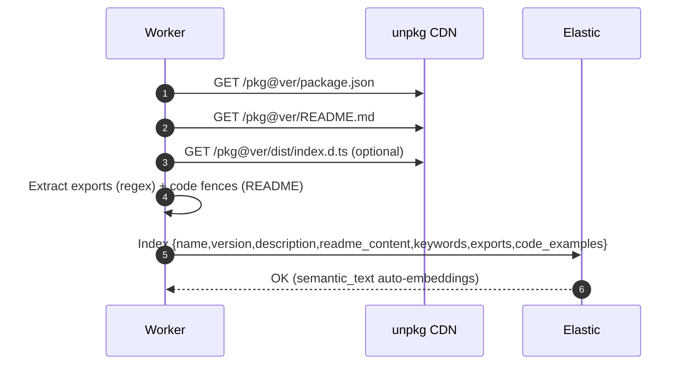
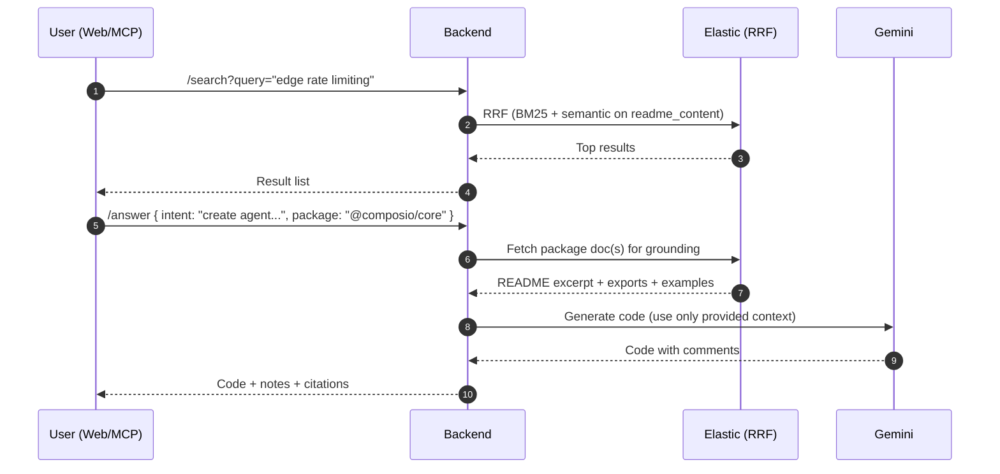

# NPM Intel — AI-Powered Package Intelligence

## Functional MVP Document (for Cursor/Windsurf)

> Goal: deliver a **search + grounded codegen** experience for **12–15 npm packages** using **Elastic Serverless (RRF + semantic_text)** and **Gemini**.
> This doc captures scope, functional requirements, flows, data model, acceptance criteria, risks, and demo plan. **No code**—purely functional.

---

## 1) Scope (What’s in / out)

### In-scope (MVP)

* **Corpus**: 12–15 packages

  * AI/Agent: `@composio/core`, `@composio/client`, `@trigger.dev/sdk`, `inngest`
  * Edge/Serverless: `@upstash/ratelimit`, `@upstash/redis`, `@planetscale/database`
  * Framework/Utils: `hono`, `elysia`, `@t3-oss/env-nextjs`, `zod`, `oslo`
* **Ingestion**: fetch `package.json`, `README.md`, optional `dist/*.d.ts` from unpkg; extract exports (light), code fences (snippets)
* **Indexing**: single Elastic index with **`semantic_text`** (auto-embeddings) for README (+ concatenated snippets); nested `exports` for symbol lookup
* **Retrieval**: **RRF hybrid** (BM25 + semantic), optional nested query for symbols
* **Answering**: Gemini grounded on Elastic hits; **light TypeScript syntax check** (transpile-only) for safety
* **Interfaces**:

  * Minimal **Web UI** (search → results → “Generate code”)
  * **MCP server** (tools: `search_packages`, `generate_code`) for Cursor/Windsurf
  * (Optional) CLI thin wrapper (not required for MVP)
* **Telemetry/Eval (optional)**: label ~12 queries and report **NDCG@10** BM25 vs RRF

### Out-of-scope (MVP)

* Full TypeScript type-checking of generated code (no `tsc --noEmit`)
* Deep AST extraction with `ts-morph` (keep exports extraction light)
* Multi-index architecture, heavy filters, or rerankers beyond RRF
* Auth, RBAC, multi-tenant

---

## 2) Users & Primary Jobs-to-Be-Done

* **App Devs (primary):** discover modern packages by intent (“edge rate limiting”), and copy **correct, grounded** starter code.
* **Hackathon Judges:** see a crisp demo of **Elastic hybrid search** + **Gemini grounding** working together, with visible citations and low setup friction.

---

## 3) Functional Requirements

### 3.1 Ingestion

* **FR-ING-1:** For each package, the system shall fetch:

  * `package.json`, `README.md`, optional `dist/index.d.ts` (if exists)
* **FR-ING-2:** The system shall extract:

  * **Exports** (names/kinds) from `.d.ts` (approximate is OK)
  * **Code snippets** from README **fenced blocks** (ts/js)
* **FR-ING-3:** The system shall **index a single document** per `name@version`:

  * `name`, `version`, `description`, `keywords[]`
  * `readme_content` (**semantic_text**, includes README + concatenated snippets)
  * `exports[]` (nested: `{kind,name,signature,jsdoc}`; plain text)
  * `code_examples` (plain text concatenation)
* **FR-ING-4:** Indexing must complete for **12–15 packages** within MVP time.

### 3.2 Search & Discovery

* **FR-SRCH-1:** The system shall support **free-text intent queries** (e.g., “durable background jobs with retries”).
* **FR-SRCH-2:** Queries use **RRF retriever** combining:

  * **BM25** over `description`, `readme_content`, `keywords`
  * **Semantic** search over `readme_content` (via **semantic_text**)
* **FR-SRCH-3:** Results must show:

  * `name@version`, short `description`, `top keywords` (if available)
* **FR-SRCH-4 (optional):** For symbol-like queries (e.g., `registerTool`), a **nested** search on `exports.name` shall be available.

### 3.3 Grounded Code Generation

* **FR-ANS-1:** “Generate code” must:

  * Pull top relevant package doc(s) from search
  * Prompt **Gemini** with **only** provided context (README excerpt, exports list, excerpts of snippets)
  * Instruct Gemini to **cite sources** (chunk/package name) in comments and to **say “insufficient context”** if not enough evidence
* **FR-ANS-2:** After generation, run a **light TypeScript syntax check** (transpile only) and, if syntax fails, retry once with error text.
* **FR-ANS-3:** Response must include:

  * Code block, short notes (“assumes env X”), visible **source/citation** reference

### 3.4 Interfaces

* **FR-UI-1 (Web):**

  * Input: search bar + preset query dropdown
  * Results: list with `name@version`, description, keywords
  * Action: “Generate code” → show code panel with copy
* **FR-MCP-1:** Provide MCP tools:

  * `search_packages(query: string)` → textual list
  * `generate_code(package: string, task: string)` → code text
* **FR-API-1:** Backend endpoints (no auth required for demo):

  * `/search?query=…` returns top results
  * `/answer` accepts `{ intent, package }` and returns `{ code, notes, citations }`

---

## 4) Non-functional Requirements

* **NFR-Perf-1:** `/search` p95 < **900ms** on 12–15 docs
* **NFR-Reliability-1:** System must degrade gracefully (e.g., show “insufficient context”)
* **NFR-Cost-1:** Operate within free/trial tiers (Elastic Serverless, Cloud Run, Gemini credits)
* **NFR-DX-1:** Setup steps in README must be < **10 minutes**

---

## 5) Success Metrics (MVP)

* **S1 (Discovery):** Judges can find **at least 3** relevant packages for each preset query.
* **S2 (Grounding):** Generated snippet references **real APIs** from the package (by name) and includes a **source note**.
* **S3 (Quality, optional):** NDCG@10 improves by **≥ +12%** with RRF vs BM25 on ~12 labeled queries.
* **S4 (Stability):** 90%+ of “Generate code” attempts return valid code (syntax-clean or retried).

---

## 6) Key Risks & Mitigations

| Risk                                | Impact                   | Mitigation                                                                 |
| ----------------------------------- | ------------------------ | -------------------------------------------------------------------------- |
| README missing or minimal           | Weak context for codegen | Prefer packages with decent READMEs; allow “insufficient context” fallback |
| Gemini produces minor syntax errors | Demo stall               | Lightweight transpile check + single repair retry                          |
| Embedding cost/latency              | Slower indexing          | Single `semantic_text` field per package (README+snippets)                 |
| Over-scope ingestion                | Miss deadline            | Limit corpus to 12–15; skip deep AST; keep `.d.ts` parse basic             |
| RRF tuning                          | Result noise             | Use default `rank_window_size`/`rank_constant`; curate preset queries      |

---

## 7) End-to-End Architecture (Mermaid)

### 7.1 System Architecture

```mermaid
flowchart LR
  subgraph DEV["User Clients"]
    WEB[Web UI]
    MCP[Cursor/Windsurf (MCP)]
  end

  subgraph API["Backend API (Cloud Run)"]
    SEARCH[/GET /search/]
    ANSWER[/POST /answer/]
  end

  subgraph ES["Elastic Serverless"]
    INDEX[(npm-packages\nsingle index)]
    RRF[Hybrid Retrieval (RRF)]
    SEM[semantic_text (Gemini embeddings)]
  end

  subgraph AI["Gemini (Vertex AI / Google AI Studio)"]
    GEN[Grounded Codegen]
  end

  subgraph SRC["Sources (CDN)"]
    UNPKG[unpkg.com]
  end

  subgraph ING["Ingestion Worker"]
    PULL[Fetch package.json + README + .d.ts]
    EXTRACT[Exports (light) + README code fences]
    INDEXER[Index doc → Elastic]
  end

  WEB --> SEARCH
  MCP --> SEARCH
  SEARCH --> RRF
  RRF --> INDEX
  ANSWER --> RRF
  RRF --> INDEX
  ANSWER --> GEN

  UNPKG --> PULL --> EXTRACT --> INDEXER --> INDEX
```

### 7.2 Ingestion Sequence



### 7.3 Search + Answer Sequence



---

## 8) Data Model (Logical)

**Index:** `npm-packages` *(one doc per `name@version`)*

* `name` (keyword)
* `version` (keyword)
* `description` (text)
* `keywords[]` (keyword)
* `readme_content` (**semantic_text**) → README + concatenated fenced code blocks
* `exports[]` (nested object)

  * `kind` (keyword) — `function|class|interface|type|const`
  * `name` (keyword)
  * `signature` (text)
  * `jsdoc` (text)
* `code_examples` (text) — concatenated snippets, redundant for UI search

---

## 9) API Contracts (No code)

### 9.1 Search

* **Method/Path:** `GET /search?query=<q>`
* **Request:** `query` (string)
* **Behavior:** RRF over BM25 (description, readme_content, keywords) + semantic on readme_content
* **Response (200):**

  ```json
  {
    "results": [
      {
        "name": "@upstash/ratelimit",
        "version": "x.y.z",
        "description": "Edge-friendly rate limiting...",
        "keywords": ["edge","ratelimit","redis"]
      }
    ]
  }
  ```

### 9.2 Answer (Grounded Code)

* **Method/Path:** `POST /answer`
* **Request:**

  ```json
  {
    "intent": "durable background job with retries",
    "package": "inngest"
  }
  ```
* **Behavior:** Pull top package doc(s) → prompt Gemini with only context → light TS syntax check (retry once if needed)
* **Response (200):**

  ```json
  {
    "code": "<TypeScript code>",
    "notes": "Source: inngest@<version>",
    "citations": ["inngest"]
  }
  ```

### 9.3 MCP (Conceptual)

* **Tool:** `search_packages({ query })` → text list
* **Tool:** `generate_code({ package, task })` → code text

---

## 10) UX Flows (Web)

1. **Discovery Flow**

   * User enters intent (or selects preset) → sees top 10 results (`name@version`, desc, keywords)
   * One-click **“Generate code”** on a selected package

2. **Generate Code Flow**

   * Backend grounds Gemini with Elastic context → returns code
   * UI shows **code block** + **source note** + “Copy” button
   * If “insufficient context,” UI suggests trying a different package or viewing README

3. **MCP Flow (Cursor/Windsurf)**

   * User types: “Find edge rate limiting libs. use npm-intel”
   * MCP tool `search_packages` returns list
   * User: “Generate code for @upstash/ratelimit, Next.js middleware” → `generate_code`

---

## 11) Preset Queries (for demo)

* “edge rate limiting for cloudflare workers”
* “durable background jobs with retries”
* “create composio agent and register tool”
* “type-safe env for next.js”
* “serverless mysql client from node”
* “event driven workflows without cron”
* “input validation with schema library (zod)”

---

## 12) Acceptance Criteria

* **AC-1:** `/search` returns ≥1 relevant package for each preset query.
* **AC-2:** `/answer` returns TypeScript code referencing **actual APIs** (by symbol name) from the selected package.
* **AC-3:** If context is insufficient, `/answer` clearly states that without hallucinating.
* **AC-4:** Web UI displays results and generated code with a visible **source/citation**.
* **AC-5:** MCP `search_packages` and `generate_code` work in Cursor/Windsurf local run.

*(Optional)*

* **AC-6:** README reports **NDCG@10** improvement with RRF over BM25 on labeled queries.

---

## 13) Timeline (3 days, ~9–12 hrs)

* **Day 1 (3–4h):** Elastic Serverless + Gemini inference; ingest & index 12 pkgs; smoke-test search.
* **Day 2 (3–4h):** Implement `/search` + `/answer` (grounded code + syntax check); basic Web UI.
* **Day 3 (3–4h):** MCP tools; presets; (optional) NDCG eval; record 2–3 min demo; polish README.

---

## 14) Demo Script (2–3 minutes)

1. **Discovery:** Query “edge rate limiting for cloudflare workers” → show `@upstash/ratelimit` top results (RRF).
2. **Codegen:** Click result → “Generate code” → grounded TypeScript snippet with **source** line.
3. **Composio:** Query “create composio agent and register tool” → pick `@composio/core` → generate code.
4. **MCP:** In Cursor: “Find durable workflows. use npm-intel” → list; “Generate code for `inngest` scheduled job” → snippet appears.
5. Close with **Elastic + Gemini** slide and (optional) **NDCG uplift**.

---

## 15) Future (post-MVP)

* Add **symbol-aware** boosts + filters (edge-ready, TypeScript presence)
* Introduce **ELSER** as an additional leg in RRF (identifier-rich boosting)
* Expand corpus to 100–500 packages; background refresh by `dist-tags.latest`
* Add **`/.well-known/llm.json`** publisher for each package (LLM discoverability)
* PR bot/checks for anti-patterns (e.g., webhook verification pitfalls)

---

This document is designed so Cursor/Windsurf (and teammates) can **clearly understand the MVP scope** and build in tight time. If you want, I can turn this into a markdown README template with checkboxes you can track during the build.
